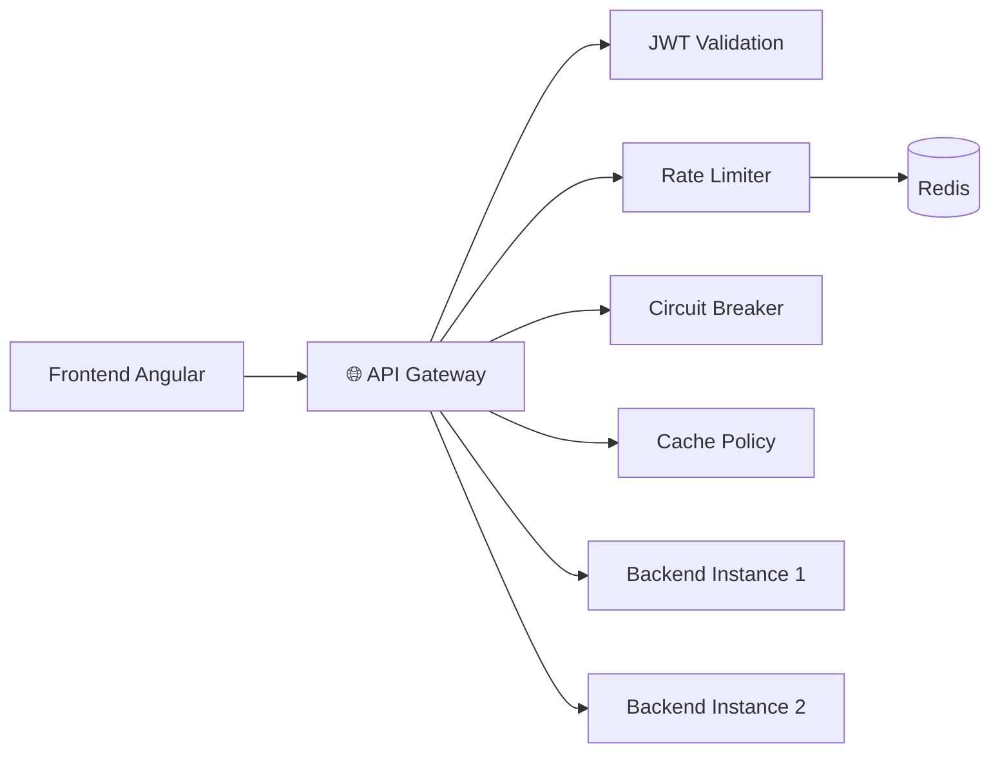
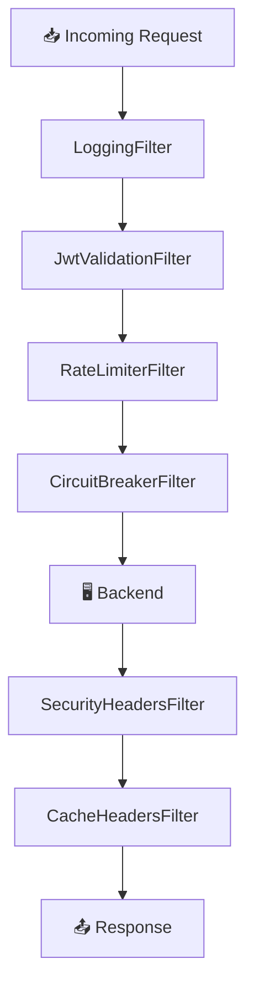
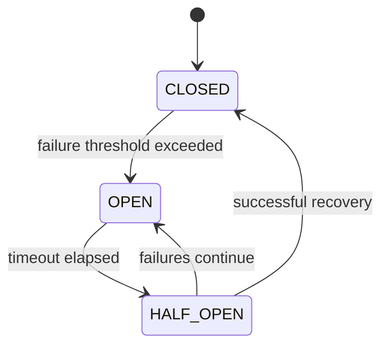

# 🌐 API Gateway — Documentación

El **API Gateway** es la puerta de entrada única al ecosistema de Hathor. Toda solicitud originada desde el frontend Angular o desde clientes externos pasa obligatoriamente por aquí antes de alcanzar cualquier servicio backend. Su responsabilidad va mucho más allá del simple enrutamiento: actúa como guardián, árbitro de tráfico, optimizador de rendimiento y primera línea de defensa del sistema.

---

## 🧱 Stack del Gateway

| Tecnología                    | Rol en el sistema                            |
| :---------------------------- | :------------------------------------------- |
| **Spring Cloud Gateway**      | Motor de enrutamiento reactivo               |
| **Spring WebFlux**            | Procesamiento no bloqueante (async/reactive) |
| **Resilience4j**              | Resiliencia: circuit breakers y retries      |
| **Redis (Upstash)**           | Rate limiting distribuido                    |
| **Spring Cloud LoadBalancer** | Balanceo de carga entre instancias           |

---

## 🗺️ Arquitectura General

El gateway opera como capa intermedia entre el cliente y el backend, intercalando un pipeline de filtros reactivos en cada solicitud entrante y saliente.



---

## 🎯 Responsabilidades del Gateway

El diseño del gateway está orientado a cumplir ocho funciones estructurales del sistema:

| Función               | Descripción                                             |
| :-------------------- | :------------------------------------------------------ |
| **Routing**           | Redirección centralizada de todo el tráfico HTTP        |
| **Load Balancing**    | Distribución de carga entre instancias backend          |
| **Resilience**        | Protección activa ante fallos con circuit breakers      |
| **Rate Limiting**     | Control de tráfico para prevenir abuso y saturación     |
| **JWT Prevalidation** | Rechazo temprano de tokens malformados o expirados      |
| **Security Headers**  | Endurecimiento HTTP en cada respuesta                   |
| **Smart Caching**     | Políticas diferenciadas de caché por tipo de dato       |
| **Observability**     | Logging estructurado con métricas de tiempo y severidad |

---

## 🔄 Pipeline de Filtros

Cada request atraviesa un pipeline de filtros reactivos de manera secuencial. El orden importa: un token inválido es rechazado antes de llegar al circuit breaker, y un límite de tasa excedido nunca consume recursos del backend.



---

## 🛣️ Configuración de Rutas

### Ruta principal

Todas las solicitudes bajo el patrón `/api/**` son redirigidas automáticamente al backend mediante balanceo de carga:

```yaml
- id: service
  uri: lb://hathor-backend
  predicates:
    - Path=/api/**
```

### Rutas con políticas especializadas

Algunas rutas reciben tratamiento diferenciado por su alta carga computacional o sensibilidad operativa:

| Ruta                                        | Motivo del trato especial         |
| :------------------------------------------ | :-------------------------------- |
| `/api/KPIs/calcular/**`                     | Cálculos financieros intensivos   |
| `/api/Benchmarking/calcularBenchmarking/**` | Comparativas de alto cómputo      |
| `/api/asistente/**`                         | Integración con IA conversacional |

Estas rutas tienen asignados circuit breakers, rate limiters y timeouts propios, distintos a la configuración general del sistema.

### Rutas públicas

Las siguientes rutas no requieren autenticación y omiten el filtro JWT:

| Ruta           | Propósito                    |
| :------------- | :--------------------------- |
| `/api/Usuario` | Registro e inicio de sesión  |
| `/api/seed`    | Inicialización de datos base |

---

## ⚖️ Balanceo de Carga

El gateway usa `ServiceInstanceListSupplier` para gestionar las instancias backend disponibles.

- **Entorno local:** instancia única en `localhost:8080`
- **Entorno productivo:** múltiples instancias remotas vía HTTPS, con alta disponibilidad y tolerancia a fallos

> 💡 **Nota de diseño:** La configuración de instancias está centralizada en `BackendInstancesConfig`, lo que facilita la transición entre ambientes sin tocar la lógica de enrutamiento.

---

## 🛡️ Resiliencia — Circuit Breakers

El gateway implementa Resilience4j con tres perfiles de circuit breaker, calibrados según la naturaleza de cada operación.

### Estados del Circuit Breaker



### Perfil General

Para operaciones estándar del sistema.

| Parámetro           | Valor |
| :------------------ | :---- |
| Sliding Window      | 20    |
| Failure Threshold   | 70%   |
| Slow Call Threshold | 70%   |
| Slow Call Duration  | 15 s  |
| Timeout             | 180 s |

### Perfil Intensivo

Aplicado a KPIs y Benchmarking. Más estricto en detección de lentitud.

| Parámetro           | Valor |
| :------------------ | :---- |
| Sliding Window      | 5     |
| Failure Threshold   | 60%   |
| Slow Call Threshold | 60%   |
| Slow Call Duration  | 20 s  |
| Timeout             | 30 s  |

### Perfil Asistente

Aplicado al módulo de IA conversacional. Tolerancia alta a latencia por la naturaleza del servicio.

| Parámetro           | Valor |
| :------------------ | :---- |
| Sliding Window      | 5     |
| Failure Threshold   | 80%   |
| Slow Call Threshold | 80%   |
| Slow Call Duration  | 40 s  |
| Timeout             | 50 s  |

### Endpoints de Fallback

Cuando un circuit breaker se abre, el gateway responde desde un endpoint de fallback para mantener la consistencia:

| Fallback              | Aplicado a                              |
| :-------------------- | :-------------------------------------- |
| `/fallback/general`   | Servicios estándar                      |
| `/fallback/intensivo` | KPIs, Benchmarking, procesos de cómputo |

---

## 🚦 Rate Limiting

El rate limiter protege los recursos del sistema contra abuso, spam y saturación. Está implementado sobre Redis para mantener los contadores entre reinicios del gateway.

### Estrategia de identificación del cliente

El limitador identifica al cliente en orden de prioridad:

1. **Usuario autenticado** — extraído del claim `sub` del JWT. Permite aplicar límites individuales por cuenta.
2. **Dirección IP** — fallback cuando no existe un JWT válido.

### Límites configurados

| Servicio         | replenishRate | burstCapacity |
| :--------------- | :-----------: | :-----------: |
| **KPIs**         |      20       |      20       |
| **Benchmarking** |      20       |      20       |
| **Asistente IA** |      10       |      15       |

### Respuesta ante exceso de peticiones

Cuando se supera el límite, el gateway responde con `HTTP 429` e incluye los siguientes headers orientativos:

| Header              | Información que provee          |
| :------------------ | :------------------------------ |
| `Retry-After`       | Segundos sugeridos de espera    |
| `X-RateLimit-Limit` | Límite configurado para la ruta |

```json
{
  "error": "TOO_MANY_REQUESTS",
  "mensaje": "Has excedido el límite de peticiones.",
  "status": 429
}
```

---

## 🔑 Validación JWT

El gateway realiza una validación ligera del JWT **antes** de que la solicitud llegue al backend. El objetivo no es reemplazar la autenticación del backend, sino rechazar tempranamente tráfico que definitivamente es inválido.

### Validaciones realizadas

| Validación           | Descripción                         |
| :------------------- | :---------------------------------- |
| Authorization Header | Existencia del token `Bearer`       |
| Estructura JWT       | Formato de tres segmentos (`x.y.z`) |
| Expiración           | Validación del claim `exp`          |

> ⚠️ **Importante:** La validación criptográfica de la firma y toda la lógica de autorización por roles es **responsabilidad exclusiva del backend**. El gateway solo hace una revisión estructural y preventiva.

---

## 🗃️ Estrategia de Caché

Las políticas de caché son diferenciadas por la volatilidad de los datos. Cachear datos en tiempo real sería un error de diseño; no cachear datos estáticos sería un desperdicio de rendimiento.

| Categoría de datos | TTL        | Ejemplos                                 | Política HTTP        |
| :----------------- | :--------- | :--------------------------------------- | :------------------- |
| **Tiempo real**    | Sin caché  | KPIs, finanzas, alertas, proyecciones    | `no-store, no-cache` |
| **Semi-estáticos** | 5 minutos  | Benchmarking general, perfil productivo  | `max-age=300`        |
| **Rankings**       | 10 minutos | Rankings de benchmarking                 | `max-age=600`        |
| **Estáticos**      | 1 hora     | Razas, categorías, reglas, prácticas BPG | `max-age=3600`       |

---

## 🔒 Seguridad HTTP

El gateway agrega headers de seguridad en todas las respuestas salientes como capa de endurecimiento HTTP.

| Header                      | Protección que ofrece                                |
| :-------------------------- | :--------------------------------------------------- |
| `X-Content-Type-Options`    | Previene MIME sniffing                               |
| `X-Frame-Options`           | Bloquea ataques de clickjacking                      |
| `Strict-Transport-Security` | Fuerza uso de HTTPS                                  |
| `Content-Security-Policy`   | Mitiga inyección de scripts (XSS)                    |
| `Referrer-Policy`           | Controla la exposición del header Referer            |
| `Permissions-Policy`        | Restringe acceso a APIs sensibles del navegador      |
| `X-XSS-Protection`          | Compatibilidad con protección XSS en browsers legacy |

La política CSP configurada es restrictiva por defecto:

```text
default-src 'self'
```

Solo se permiten recursos del mismo origen.

---

## 📊 Observabilidad y Logging

El gateway registra información estructurada de cada solicitud para facilitar el monitoreo, la trazabilidad y el diagnóstico de problemas.

### Campos registrados

| Campo       | Descripción                          |
| :---------- | :----------------------------------- |
| Método HTTP | `GET`, `POST`, `PUT`, `DELETE`, etc. |
| Ruta        | Endpoint solicitado                  |
| IP Cliente  | Origen de la solicitud               |
| User ID     | Extraído del JWT (si aplica)         |
| Status HTTP | Código de respuesta del backend      |
| Tiempo      | Duración total de la request en ms   |

### Código de severidad visual

| Código | Estado             | Indicador |
| :----- | :----------------- | :-------: |
| `2xx`  | Exitoso            |    🟢     |
| `3xx`  | Redirección        |    🔵     |
| `4xx`  | Error del cliente  |    🟡     |
| `5xx`  | Error del servidor |    🔴     |

> 🐢 **Requests lentos:** Toda solicitud que supere los **3000 ms** es marcada adicionalmente con la etiqueta `REQUEST LENTO` en el log para facilitar su identificación durante el monitoreo.

---

## 🌍 Configuración CORS

El gateway gestiona las políticas de CORS centralizando los orígenes autorizados:

- `localhost` (desarrollo Angular)
- Dominios de **Vercel** (producción frontend)
- Tunnels de **ngrok** (testing y demos)

**Métodos HTTP permitidos:** `GET`, `POST`, `PUT`, `DELETE`, `OPTIONS`, `PATCH`

---

## 🔁 Manejo Centralizado de Errores

Para mantener consistencia entre servicios, el gateway estandariza todas las respuestas de error en el mismo formato JSON:

**HTTP 503 — Servicio no disponible:**

```json
{
  "error": "SERVICIO_NO_DISPONIBLE",
  "mensaje": "El servicio no está disponible.",
  "status": 503
}
```

**HTTP 429 — Límite de tasa excedido:**

```json
{
  "error": "TOO_MANY_REQUESTS",
  "mensaje": "Has excedido el límite de peticiones.",
  "status": 429
}
```
