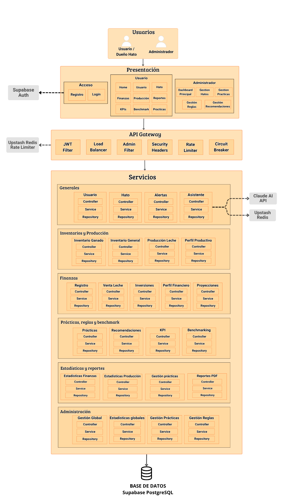

# 🏛️ Arquitectura — Documentación

**Hathor** está construido bajo una arquitectura moderna, desacoplada y escalable organizada en tres capas bien definidas: presentación, gateway y servicios. Cada capa tiene responsabilidades claras y se comunica con la siguiente a través de contratos explícitos, garantizando independencia, mantenibilidad y escalabilidad horizontal del sistema.

---

## 🗺️ Vista General del Sistema

    

---

## 👥 Capa de Presentación

La capa de presentación expone dos perfiles de usuario con interfaces diferenciadas.

El **Usuario / Dueño de Hato** accede a los módulos operativos del sistema: Home, gestión de usuarios y hatos, finanzas, producción, reportes, KPIs, benchmarking y prácticas productivas. El **Administrador** dispone de un dashboard principal y módulos de gestión transversal: hatos, prácticas, reglas y recomendaciones.

El acceso al sistema está gestionado mediante **Supabase Auth**, que centraliza los flujos de registro e inicio de sesión.

---

## 🌐 API Gateway

Toda solicitud originada desde la capa de presentación pasa obligatoriamente por el **API Gateway** antes de alcanzar cualquier servicio del backend. El gateway actúa como guardián, árbitro de tráfico y primera línea de defensa del sistema mediante un pipeline de filtros reactivos:

| Componente           | Responsabilidad                                    |
| :------------------- | :------------------------------------------------- |
| **JWT Filter**       | Validación estructural y preventiva de tokens      |
| **Load Balancer**    | Distribución de carga entre instancias backend     |
| **Admin Filter**     | Restricción de rutas administrativas               |
| **Security Headers** | Endurecimiento HTTP en cada respuesta saliente     |
| **Rate Limiter**     | Control de tráfico apoyado en **Upstash Redis**    |
| **Circuit Breaker**  | Protección activa ante fallos en servicios backend |

> 💡 **Nota de diseño:** La validación criptográfica de tokens y la lógica de autorización por roles son responsabilidad exclusiva del backend. El gateway realiza únicamente una revisión estructural y preventiva para rechazar tráfico inválido de forma temprana.

---

## ⚙️ Capa de Servicios

El backend está organizado en seis grupos funcionales. Cada módulo sigue una estructura uniforme de tres capas: **Controller → Service → Repository**.

### Generales

Núcleo operativo del sistema. Agrupa los módulos de **Usuario**, **Hato**, **Alertas** y **Asistente**. El módulo de Asistente se integra externamente con la **Claude AI API** para el procesamiento de lenguaje natural, y con **Upstash Redis** para la gestión de contexto conversacional.

### Inventarios y Producción

Gestiona los activos físicos y el registro productivo del hato: **Inventario Ganado**, **Inventario General**, **Producción Leche** y **Perfil Productivo**.

### Finanzas

Controla el ciclo financiero completo del hato a través de cinco módulos: **Registro**, **Venta Leche**, **Inversiones**, **Perfil Financiero** y **Proyecciones**.

### Prácticas, Reglas y Benchmark

Motor analítico y de recomendación del sistema. Integra los módulos de **Prácticas**, **Recomendaciones**, **KPI** y **Benchmarking**, que trabajan en conjunto para evaluar el desempeño del hato y sugerir acciones de mejora.

### Estadísticas y Reportes

Capa de análisis y salida documental. Comprende **Estadísticas Finanzas**, **Estadísticas Producción**, **Gestión Prácticas** y **Reportes PDF**.

### Administración

Módulos de gestión transversal accesibles únicamente por el perfil administrador: **Gestión Global**, **Estadísticas Globales**, **Gestión Prácticas** y **Gestión Reglas**.

---

## 🗄️ Base de Datos

Todos los servicios del backend persisten en una base de datos relacional **PostgreSQL** gestionada a través de **Supabase**. El modelo de datos centraliza tanto información operativa generada por los usuarios como catálogos y referencias estáticas utilizadas por los motores de cálculo y recomendación.

> 💡 **Más detalle:** La estructura completa del modelo de datos, sus entidades, relaciones y parametrización inicial están documentadas en la sección **[Base de Datos](sql.md)**.

---

## 🔗 Integraciones Externas

| Servicio                | Uso dentro del sistema                                |
| :---------------------- | :---------------------------------------------------- |
| **Supabase Auth**       | Autenticación y gestión de sesiones de usuario        |
| **Supabase PostgreSQL** | Persistencia relacional de todos los módulos          |
| **Upstash Redis**       | Rate limiting distribuido y contexto del asistente IA |
| **Claude AI API**       | Motor de lenguaje natural del módulo Asistente        |
