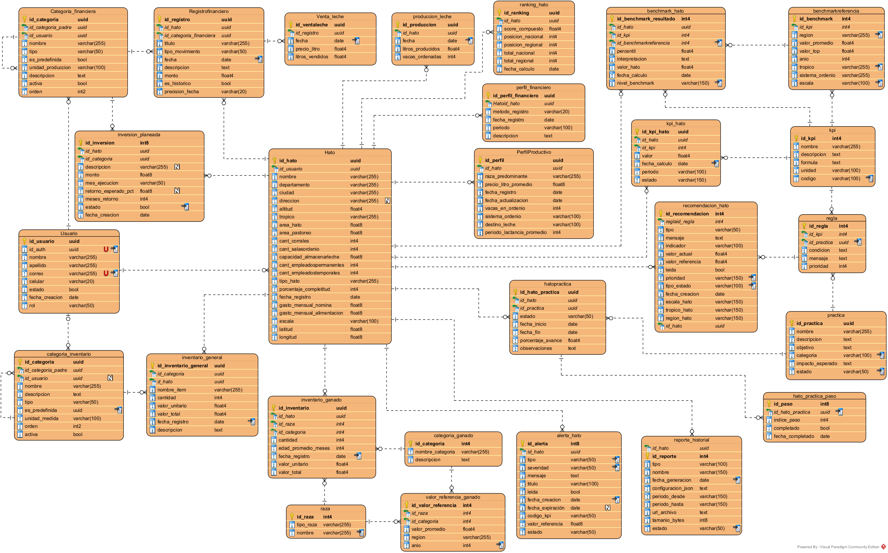
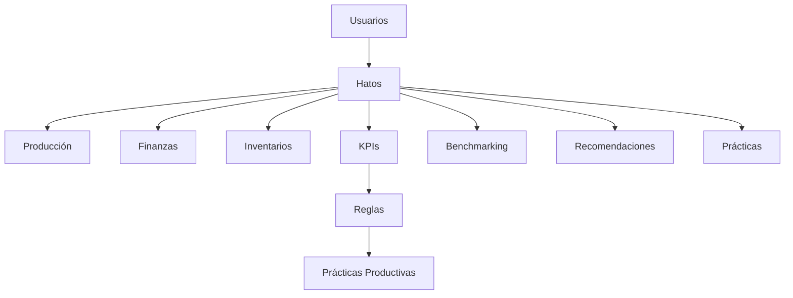
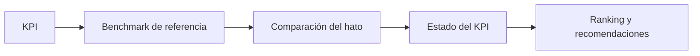
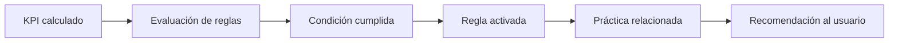

# 🗄️ Base de Datos — Documentación

La base de datos de **Hathor** constituye el núcleo de persistencia y parametrización del sistema. Su diseño está orientado a soportar procesos de análisis productivo, benchmarking ganadero, evaluación financiera, recomendaciones inteligentes y seguimiento operativo de hatos lecheros.

La arquitectura fue diseñada bajo un enfoque relacional que garantiza integridad referencial, consistencia transaccional, parametrización flexible, desacoplamiento de reglas de negocio y soporte analítico para KPIs y benchmarking.

---

## 🎯 Objetivos del Modelo de Datos

El modelo fue estructurado para soportar las siguientes capacidades funcionales:

| Área                 | Propósito                                  |
| :------------------- | :----------------------------------------- |
| **Gestión de Hatos** | Administración de información ganadera     |
| **Producción**       | Registro y análisis de producción lechera  |
| **KPIs**             | Almacenamiento y evaluación de indicadores |
| **Benchmarking**     | Comparación con referencias regionales     |
| **Recomendaciones**  | Generación de alertas y acciones           |
| **Finanzas**         | Control financiero y categorización        |
| **Inventarios**      | Seguimiento de activos y ganado            |
| **Prácticas**        | Adopción y seguimiento de prácticas        |
| **Reportes**         | Historial y trazabilidad documental        |

---

## 🗺️ Modelo Entidad-Relación

El sistema utiliza un modelo relacional compuesto por entidades operativas, entidades analíticas y tablas de parametrización.

<div align="center">
    
</div>

---

## 🏗️ Arquitectura del Modelo

La estructura puede dividirse conceptualmente en múltiples dominios funcionales, con el **Usuario** y el **Hato** como entidades raíz del sistema.



---

## 🧱 Núcleo Operacional

### Usuario

La entidad `usuario` representa los usuarios autenticados del sistema y actúa como punto de asociación principal para la administración de hatos. Sus responsabilidades incluyen autenticación lógica, gestión de roles, asociación de hatos y ownership de información financiera.

### Hato

La entidad `hato` constituye el núcleo principal del dominio ganadero. Almacena información de ubicación geográfica, características productivas, infraestructura, capacidad operativa, escala productiva e información laboral. Además, funciona como entidad raíz para múltiples módulos del sistema.

| Relación            | Descripción              |
| :------------------ | :----------------------- |
| **Producción**      | Registros lecheros       |
| **KPIs**            | Indicadores calculados   |
| **Finanzas**        | Movimientos financieros  |
| **Inventarios**     | Activos y ganado         |
| **Benchmarking**    | Comparaciones analíticas |
| **Recomendaciones** | Alertas y sugerencias    |

---

## 🥛 Módulo Productivo

### Producción de Leche

La tabla `produccion_leche` registra información diaria de litros producidos, vacas ordeñadas y fechas de producción. Estos registros sirven como base para cálculos analíticos y generación de KPIs.

### Perfil Productivo

La entidad `perfil_productivo` almacena las características generales del sistema productivo del hato: raza predominante, producción diaria, sistema y frecuencia de ordeño, y destino de la leche. Esta información es consumida por los módulos de benchmarking, recomendaciones y contextualización de indicadores.

---

## 📊 KPIs y Benchmarking

### KPIs

La tabla `kpi` define los indicadores utilizados por el sistema. Cada KPI incluye nombre, descripción, fórmula, unidad de medida, código único y categoría.

| Campo           | Descripción           |
| :-------------- | :-------------------- |
| **nombre**      | Nombre del indicador  |
| **descripción** | Explicación funcional |
| **fórmula**     | Expresión de cálculo  |
| **unidad**      | Unidad de medida      |
| **código**      | Identificador único   |

#### Ejemplo de inserción

```sql
INSERT INTO kpi (
    nombre,
    descripcion,
    formula,
    unidad,
    codigo
)
VALUES
(
    'Litros/Vaca/Día',
    'Productividad diaria por vaca en ordeño.',
    'produccion_diaria_litros / vacas_en_ordenio',
    'L/vaca/día',
    'KPI_LITROS_VACA_DIA'
),
(
    'Litros/Ha/Año',
    'Producción anual de leche por hectárea.',
    'SUM(litros_producidos_anio) / area_pastoreo',
    'L/ha/año',
    'KPI_LITROS_HA_ANIO'
);
```

### KPI Hato

La tabla `kpi_hato` almacena los valores calculados para cada hato, permitiendo historial de indicadores, seguimiento temporal y análisis comparativo.

### Benchmarking de Referencia

La tabla `benchmarkreferencia` almacena los valores de referencia utilizados para comparar el desempeño de los hatos: promedios nacionales y valores altos esperados del mercado para cada KPI.

| Campo                 | Descripción              |
| :-------------------- | :----------------------- |
| **KPI asociado**      | Indicador evaluado       |
| **valor_promedio**    | Promedio esperado        |
| **valor_top**         | Valor alto de referencia |
| **región**            | Alcance geográfico       |
| **trópico**           | Contexto productivo      |
| **escala**            | Tamaño del hato          |
| **sistema de ordeño** | Tipo de producción       |

#### Ejemplo de inserción

```sql
INSERT INTO benchmarkreferencia (
    id_kpi,
    region,
    valor_promedio,
    valor_top,
    anio,
    tropico,
    sistema_ordenio,
    escala
)
SELECT
    id_kpi,
    'NACIONAL',
    4.5,
    15.0,
    2024,
    NULL,
    NULL,
    NULL
FROM kpi
WHERE codigo = 'KPI_LITROS_VACA_DIA';
```

> 💡 **Nota de diseño:** En este ejemplo el promedio nacional esperado es `4.5` L/vaca/día y el valor alto de referencia es `15.0`. El sistema utiliza estos valores para calcular percentiles, estados del KPI, rankings, alertas y recomendaciones.

### Ranking Nacional y Regional

La tabla `ranking_hato` consolida score compuesto, posición nacional, posición regional y métricas comparativas, permitiendo evaluar la competitividad productiva entre hatos.



---

## ⚙️ Motor de Reglas y Recomendaciones

Uno de los componentes más importantes del modelo es el sistema parametrizado de reglas y recomendaciones. Su objetivo es detectar situaciones críticas dentro del hato y activar acciones automáticas de apoyo al usuario.

### Reglas

La entidad `regla` define condiciones evaluables sobre KPIs. Permite detectar estados críticos, disparar recomendaciones y asociar prácticas productivas.

| Capacidad       | Descripción                   |
| :-------------- | :---------------------------- |
| **Umbrales**    | Absolutos o relativos         |
| **Operadores**  | Comparación configurable      |
| **Escalas**     | Adaptación por tamaño de hato |
| **Estados KPI** | Clasificación automática      |

#### Ejemplo de inserción

```sql
INSERT INTO regla (
    id_kpi,
    operador,
    umbral_1,
    umbral_2,
    umbral_tipo,
    estado_kpi_objetivo,
    escala_aplicable,
    estado,
    mensaje,
    prioridad
)
SELECT
    id_kpi,
    'MENOR_PCT_PROMEDIO',
    0.70,
    NULL,
    'PCT_PROMEDIO',
    'CRITICO',
    'TODAS',
    'ACTIVA',
    'Tu producción por vaca está más del 30% por debajo del promedio de hatos similares.',
    1
FROM kpi
WHERE codigo = 'KPI_LITROS_VACA_DIA';
```

> 📌 **Funcionamiento:** El sistema evalúa `KPI_LITROS_VACA_DIA` y, si el valor actual es menor al 70% del promedio esperado, el KPI se clasifica como crítico y se activan las recomendaciones y prácticas asociadas.

### Prácticas Productivas

La tabla `practica` almacena acciones sugeridas para mejorar indicadores productivos. Cada práctica incluye nombre, descripción, objetivo, impacto esperado, dificultad, duración estimada, pasos sugeridos y KPI relacionado.

#### Ejemplo de inserción

```sql
INSERT INTO practica (
    nombre,
    descripcion,
    objetivo,
    categoria,
    impacto_esperado,
    estado,
    pasos,
    kpi_impactado,
    dificultad,
    duracion_dias,
    escala,
    tropico_aplicable
)
VALUES (
    'Optimización de estructura de personal',
    'Revisión de la asignación de tareas del personal del hato.',
    'Reducir el costo laboral por litro producido.',
    'EFICIENCIA',
    'Mejora indicadores de productividad laboral.',
    'ACTIVA',
    '[...]',
    'KPI_COSTO_LABORAL_PCT',
    'MEDIA',
    60,
    'TODAS',
    'TODOS'
);
```

### Relación Regla-Práctica

La tabla `regla_practica` desacopla la lógica de recomendación implementando una relación muchos-a-muchos entre reglas y prácticas. Esto permite múltiples prácticas por regla, priorización configurable y flexibilidad evolutiva.

#### Ejemplo de inserción

```sql
INSERT INTO regla_practica (
    id_regla,
    id_practica,
    orden
)
SELECT
    r.id_regla,
    p.id_practica,
    1
FROM regla r, practica p
WHERE r.id_kpi = (
    SELECT id_kpi
    FROM kpi
    WHERE codigo = 'KPI_LITROS_VACA_DIA'
)
AND r.estado_kpi_objetivo = 'CRITICO'
AND p.nombre = 'Protocolo de ordeño higiénico'
AND p.escala = 'TODAS';
```

### Flujo del Motor de Reglas



### Recomendaciones

El sistema maneja dos tipos de recomendaciones para garantizar seguimiento, priorización y persistencia histórica:

| Tipo                      | Descripción                 |
| :------------------------ | :-------------------------- |
| **recomendacion_hato**    | Recomendaciones específicas |
| **recomendacion_general** | Recomendaciones globales    |

### Alertas

La tabla `alerta_hato` administra eventos críticos relacionados con indicadores y estados operativos, incluyendo severidad, expiración, estado y asociación a KPIs.

---

## 📦 Inventarios

### Inventario Ganadero

La tabla `inventario_ganado` almacena razas, categorías, cantidades y valorización económica del ganado.

### Inventario General

La tabla `inventario_general` administra activos, herramientas, recursos y elementos operativos del hato.

---

## 🏷️ Catálogos y Parametrización

El sistema utiliza múltiples tablas de referencia para evitar lógica hardcodeada. Una parte significativa de la lógica funcional se encuentra parametrizada en base de datos, lo que permite ajustes evolutivos, cambios sin recompilación, adaptación regional y flexibilidad operativa.

### Categorías de Inventario

La tabla `categoria_inventario` define estructuras jerárquicas para clasificar activos e infraestructura del hato: maquinaria, instalaciones, equipos, herramientas y recursos operativos. La estructura implementa relaciones padre-hijo para permitir agrupaciones jerárquicas.

#### Ejemplo de inserción

```sql
-- Categoría padre
INSERT INTO public.categoria_inventario
    (nombre, descripcion, tipo, es_predefinida, orden, activa)
VALUES
    (
        'INFRAESTRUCTURA E INSTALACIONES',
        'Instalaciones físicas del hato',
        'PADRE',
        true,
        10,
        true
    );

-- Categorías hijas
WITH padre AS (
    SELECT id_categoria
    FROM public.categoria_inventario
    WHERE nombre = 'INFRAESTRUCTURA E INSTALACIONES'
)
INSERT INTO public.categoria_inventario
    (nombre, descripcion, tipo, id_categoria_padre, es_predefinida, unidad_medida, orden, activa)
VALUES
    (
        'Cuartos de leche',
        'Área de almacenamiento y enfriamiento',
        'HIJA',
        (SELECT id_categoria FROM padre),
        true,
        'metros²',
        13,
        true
    );
```

| Característica      | Descripción                      |
| :------------------ | :------------------------------- |
| **Jerarquía**       | Soporte padre-hijo               |
| **Personalización** | Usuarios pueden crear categorías |
| **Parametrización** | Categorías reutilizables         |
| **Organización**    | Clasificación estructurada       |

### Categorías de Ganado

La tabla `categoria_ganado` parametriza los tipos de ganado según edad, sexo, etapa productiva y condición reproductiva. Son utilizadas por inventarios ganaderos, valorización, análisis productivos y referencias estadísticas.

#### Ejemplo de inserción

```sql
INSERT INTO public.categoria_ganado
    (nombre_categoria, descripcion)
VALUES
    ('Ternero',           'Machos desde el nacimiento hasta el destete'),
    ('Ternera',           'Hembras desde el nacimiento hasta el destete'),
    ('Vaca de producción','Vaca en etapa de lactancia'),
    ('Vaca seca',         'Vaca en periodo seco');
```

### Categorías Financieras

La tabla `categoria_financiera` implementa un sistema jerárquico flexible para clasificar movimientos financieros: ingresos, gastos, costos e inversiones. El sistema incluye categorías iniciales predefinidas y permite que cada usuario amplíe la estructura según sus necesidades.

La estructura financiera utiliza múltiples niveles jerárquicos:

```text
GENERAL
└── INGRESOS
    ├── VENTA DE LECHE
    ├── VENTA DE ANIMALES
    └── VENTA DE DERIVADOS LÁCTEOS
```

#### Ejemplo de inserción

```sql
-- Nodo principal
WITH general AS (
    SELECT id_categoria
    FROM public.categoria_financiera
    WHERE nombre = 'GENERAL'
)
INSERT INTO public.categoria_financiera
    (id_usuario, nombre, descripcion, tipo, id_categoria_padre, es_predefinida, orden)
VALUES
    (
        NULL,
        'INGRESOS',
        'Todo tipo de entradas de capital',
        'INGRESO',
        (SELECT id_categoria FROM general),
        true,
        1
    );

-- Subcategorías
WITH ingresos_root AS (
    SELECT id_categoria
    FROM public.categoria_financiera
    WHERE nombre = 'INGRESOS'
)
INSERT INTO public.categoria_financiera
    (id_usuario, nombre, descripcion, tipo, id_categoria_padre, es_predefinida, orden)
VALUES
(
    NULL,
    'VENTA DE LECHE',
    'Venta de leche cruda a industria o terceros',
    'INGRESO',
    (SELECT id_categoria FROM ingresos_root),
    true,
    2
),
(
    NULL,
    'VENTA DE ANIMALES',
    'Venta de ganado',
    'INGRESO',
    (SELECT id_categoria FROM ingresos_root),
    true,
    3
);
```

### Razas

La tabla `raza` almacena las diferentes razas de ganado utilizadas dentro del sistema, agrupadas por tipo general. Son utilizadas para clasificar inventario, análisis productivos, benchmarking y valorización económica.

#### Ejemplo de inserción

```sql
INSERT INTO public.raza (tipo_raza, nombre) VALUES
    ('PURA ESPECIALIZADA', 'Holstein-Friesian'),
    ('PURA ESPECIALIZADA', 'Jersey'),
    ('PURA ESPECIALIZADA', 'Pardo Suizo (Brown Swiss)'),
    ('PURA ESPECIALIZADA', 'Ayrshire');
```

| Módulo           | Uso                         |
| :--------------- | :-------------------------- |
| **Inventario**   | Clasificación del ganado    |
| **KPIs**         | Análisis productivo         |
| **Benchmarking** | Comparación entre hatos     |
| **Referencias**  | Valores promedio de mercado |

### Valores de Referencia de Ganado

La tabla `valorreferenciaganado` almacena valores promedio de mercado para diferentes tipos de ganado, definidos según raza, categoría, región y año. Sirven como referencia económica para valorización de inventarios, análisis financieros y estimaciones patrimoniales.

#### Ejemplo de inserción

```sql
INSERT INTO public.valorreferenciaganado
    (id_raza, id_categoria, valor_promedio, region, anio)
VALUES
-- Holstein-Friesian
(
    2,
    (SELECT id_categoria FROM public.categoria_ganado WHERE nombre_categoria = 'Vaca de producción'),
    8500000,
    'Nacional',
    2025
),
-- Jersey
(
    3,
    (SELECT id_categoria FROM public.categoria_ganado WHERE nombre_categoria = 'Vaca de producción'),
    7800000,
    'Nacional',
    2025
);
```

| Campo              | Descripción                   |
| :----------------- | :---------------------------- |
| **id_raza**        | Raza asociada                 |
| **id_categoria**   | Categoría del ganado          |
| **valor_promedio** | Precio promedio de referencia |
| **region**         | Región de referencia          |
| **anio**           | Año del valor registrado      |

---

## 💰 Módulo Financiero

### Perfil Financiero

La tabla `perfil_financiero` almacena configuraciones generales del modelo financiero del hato.

### Detalle Financiero

La entidad `perfil_financiero_detalle` registra ingresos, gastos, costos e inversiones.

### Registro Financiero

La tabla `registrofinanciero` administra movimientos financieros históricos y operativos.

### Inversiones Planeadas

La entidad `inversion_planeada` permite gestionar inversiones futuras con retorno esperado y horizonte de recuperación.

---

## 📋 Reportes

La tabla `reporte_historial` almacena información relacionada con generación de reportes, archivos exportados, configuraciones utilizadas y trazabilidad documental.

---

## 🔩 Consideraciones Técnicas

### Integridad Referencial

El modelo utiliza claves foráneas para garantizar consistencia entre todas las entidades relacionadas.

### Identificadores

| Tipo          | Uso                     |
| :------------ | :---------------------- |
| **UUID**      | Entidades operativas    |
| **Identity**  | Catálogos y referencias |
| **Sequences** | Registros históricos    |

### Escalabilidad

La separación entre datos operativos, datos analíticos y datos parametrizados permite escalar módulos funcionales de forma independiente.

> 💡 **Filosofía de parametrización:** La mayor parte de la lógica funcional del sistema — reglas, benchmarking, recomendaciones, categorías y referencias productivas — está administrada desde base de datos y no hardcodeada en el backend. Esto permite evolución funcional sin recompilar, adaptación regional y personalización por usuario.
